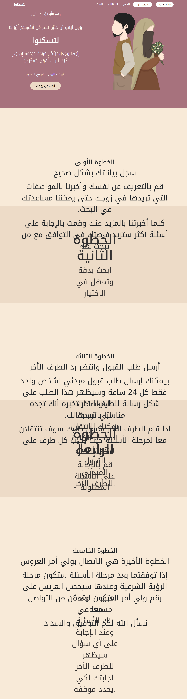
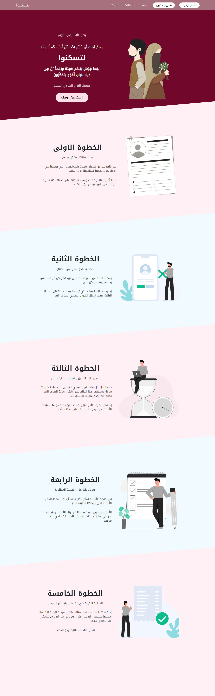

# السلام عليكم ورحمة الله وبركاته

I found this project useful and I would like to contribute to it. This is my first contribution and not the last insha'Allah IF YOU DON'T MIND.

> In simple words, I'm Ahmed, Front-end developer.

## The problem:
- Firstly I noticed some bugs in the UI. For example, In the `index.js` page `(The home page)`, You made the font size with `vw` unit. This is not a good practice because it will make the font size bigger on bigger screens and smaller on smaller screens. 

- Also The image doesn't appear in the computer screen.

See This screenshot:
Notice the font size of the second, third, etc.. sections. It's too big in the computer screen.

---

## The solution:

- I merged the two `StepOne.module.css` and `StepTwo.module.css` files into one file called `Step.module.css`. 
- I changed the font size to `rem` unit. This will make the font size better and more consistent.
- Improved the UI.
- Fixed the image problem using flexbox.
- Added two colors as background colors for the sections. one is very light skyblue refers to males and second is very light pink refers to females. 
- Changed the color and some styles for the heading section. 
- Added a nice sharp for sections.
- Some little changes to imporve the SEO.

See This screenshot:

--- 

## Next steps:

I noticed some other stuff that I would like to improve in the future. Later I am going to work on IF YOU DON'T MIND. Let me know if you mind.

## Thank you for the great job you have done. I hope you like my contribution.

### والحمد لله رب العالمين وصلى الله على سيدنا محمد وعلى آله وصحبه وسلم.
